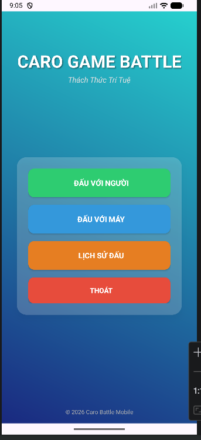
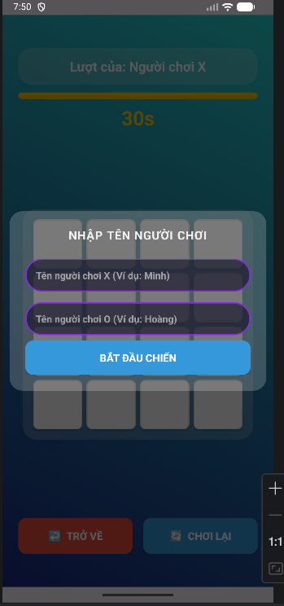
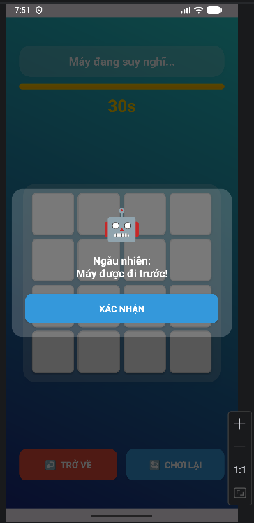
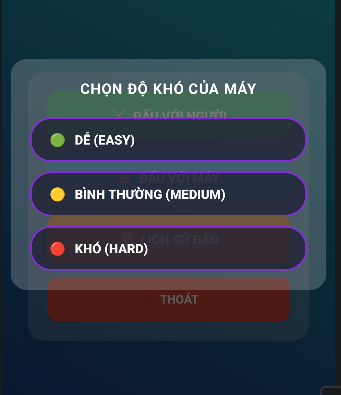
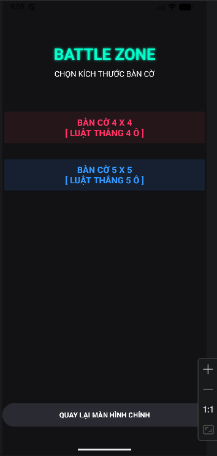
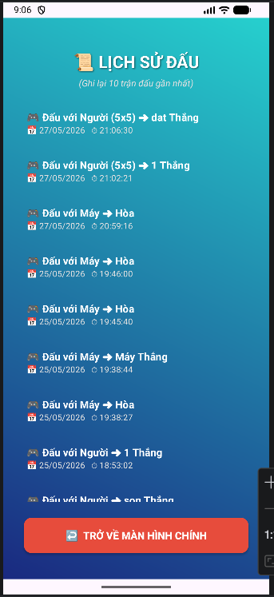

## Video demo
https://drive.google.com/file/d/1O8_G2vcT4SmEyHUJlNfK7zyfLtJ4w_WZ/view?usp=drive_link
# 65130454-CaroBattleAI
Ứng dụng game cờ caro (đối kháng 4x4) tốc độ cao trên nền tảng Android (Java) với giao diện Neon hiện đại, tích hợp AI và đám mây.

---

## ✨ Tính Năng Nổi Bật

* **2 Chế độ chơi:** PvP (Người đấu với Người - hỗ trợ nhập tên đối kháng) và PvE (Đấu với Máy - 3 cấp độ Dễ/Trung bình/Khó).
* **Đếm ngược 30s chuyên nghiệp:** Mỗi lượt có 30 giây suy nghĩ. Hết giờ hệ thống tự đánh hộ. Thanh thời gian tự đổi màu theo phe (**Đỏ** cho X, **Xanh** cho O).
* **Khóa thời gian thông minh:** Đồng hồ đứng im tuyệt đối khi gõ tên hoặc khi hiện Dialog bốc thăm đầu trận để đảm bảo công bằng.
* **Bốc thăm ngẫu nhiên:** Tung xúc xắc ngẫu nhiên để chọn bên đi trước khi bắt đầu trận đấu.
* **Lịch sử đấu Firebase:** Tự động lưu kết quả, chế độ chơi và ngày giờ lên Firebase Realtime Database.
* **Tối ưu trải nghiệm:** Tự động dừng nhạc nền và đếm ngược khi ẩn ứng dụng để tiết kiệm pin.

---

## 🛠️ Công Nghệ Sử Dụng

* **Ngôn ngữ:** Java (Android SDK)
* **Giao diện:** XML Layout, Custom Neon Progress Bar, Custom Dialog trong suốt.
* **Đám mây:** Firebase Realtime Database.
* **Thời gian:** Android CountDownTimer.

---

## 📸 Hình Ảnh Giao Diện

* **Màn hình chính:** Ứng dụng sở hữu menu chính trực quan, thiết kế theo phong cách Neon hiện đại giúp người chơi dễ dàng lựa chọn các chế độ chơi và xem lại lịch sử đấu.
  

* **Chế độ PvP (Đấu với Người):** Giao diện thi đấu hai người với thanh thời gian đếm ngược thông minh, tự động đổi màu sắc và khóa giờ khi đang tương tác hộp thoại.
  

* **Chế độ PvE (Đấu với Máy):** Màn hình đối đầu trực tiếp với AI thông minh của hệ thống. Đồng hồ thời gian sẽ tự động tối ưu dựa theo lượt tính toán của Máy.
  

* **Bảng lựa chọn độ khó:** Hệ thống cung cấp 3 cấp độ AI (Dễ, Bình thường, Khó) phù hợp với trình độ từ người mới bắt đầu đến các kỳ thủ lão luyện.
  

* **Bảng lựa chọn bàn cờ:** bên cạnh bàn cờ 4x4 còn có bàn cờ 5x5 để nâng tầm tư duy của người chơi và giảm cảm giác chán khi phải chơi 4x4 liên tục.
  

* **Lịch sử trận đấu:** Bảng thống kê hiển thị chi tiết kết quả các trận đấu trước đó, được đồng bộ trực tiếp theo thời gian thực từ cơ sở dữ liệu Firebase đám mây.
  
