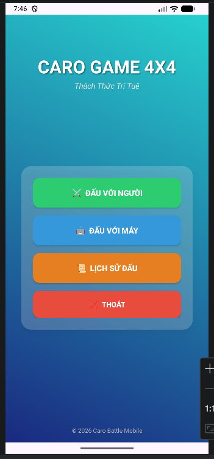
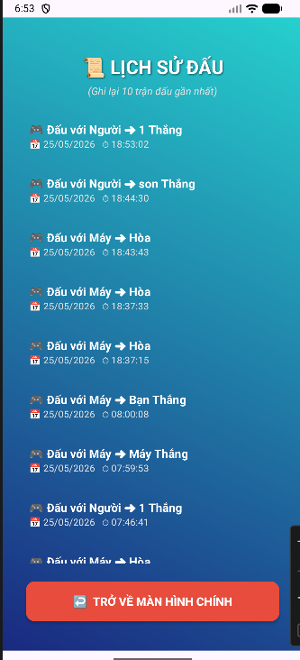

# 65130454-CaroBattleAI
Ứng dụng game cờ caro (đối kháng 4x4) tốc độ cao trên nền tảng Android (Java) với giao diện Neon hiện đại, tích hợp AI và đám mây.

---

## ✨ Tính Năng Nổi Bật

* **2 Chế độ chơi:** PvP (Người đấu với Người - hỗ trợ nhập tên đối kháng) và PvE (Đấu với Máy - 3 cấp độ Dễ/Trung bình/Khó).
* **Đếm ngược 30s chuyên nghiệp:** Mỗi lượt có 30 giây suy nghĩ. Hết giờ hệ thống tự đánh hộ. Thanh thời gian tự đổi màu theo phe (**Đỏ** cho X, **Xanh** cho O).
* **Khóa thời gian thông minh:** Đồng hồ đứng im tuyệt đối khi gõ tên hoặc khi hiện Dialog bốc thăm đầu trận để đảm bảo công bằng.
* **Bốc thăm ngẫu nhiên:** Tung xúc xắc ngẫu nhiên để chọn bên đi trước khi bắt đầu trận đấu.
* **Lịch sử đấu Firebase:** Tự động lưu kết quả, chế độ chơi và ngày giờ lên Firebase Realtime Database.
* **Tối ưu trải nghiệm:** Tự động dừng nhạc nền và đếm ngược khi ẩn ứng dụng để tiết kiệm pin.

---

## 🛠️ Công Nghệ Sử Dụng

* **Ngôn ngữ:** Java (Android SDK)
* **Giao diện:** XML Layout, Custom Neon Progress Bar, Custom Dialog trong suốt.
* **Đám mây:** Firebase Realtime Database.
* **Thời gian:** Android CountDownTimer.

---

## 📸 Hình Ảnh Giao Diện

* **Màn hình chính:** 
* **Chế độ PvP:** 
* **Chế độ PvE:** 
* **Chọn độ khó:** 
* **Lịch sử đấu:** 
